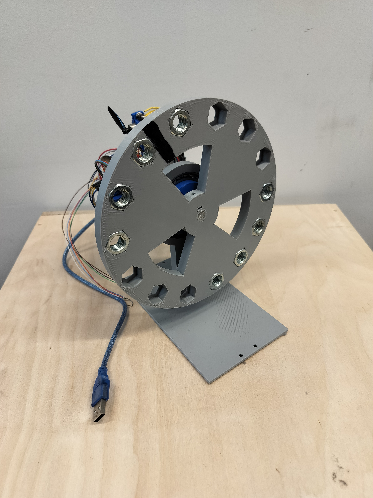
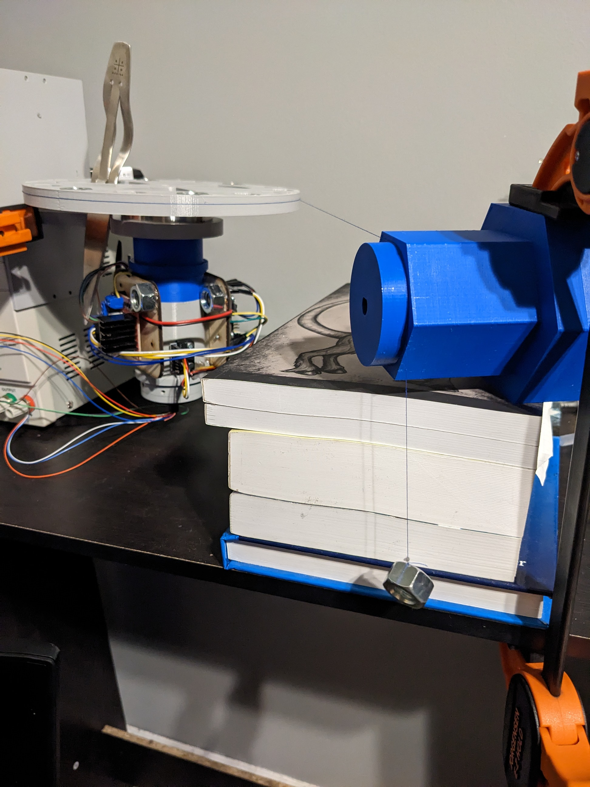
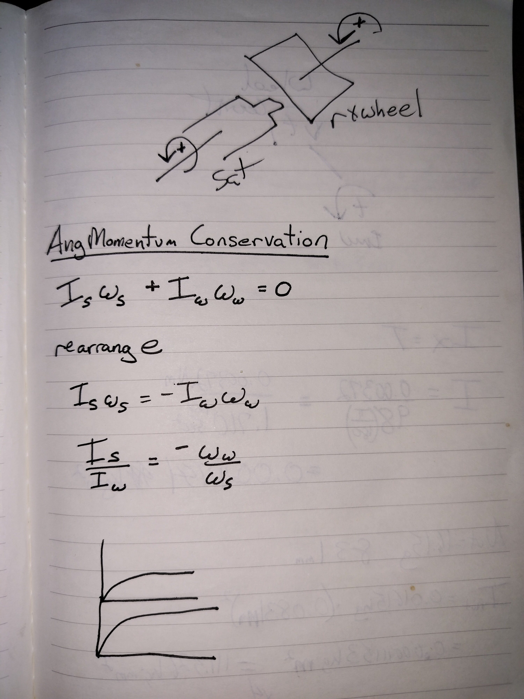
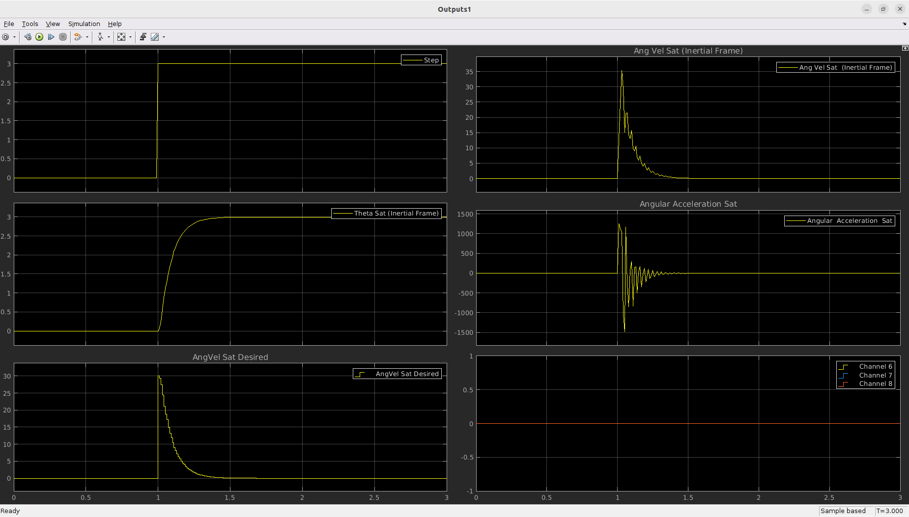
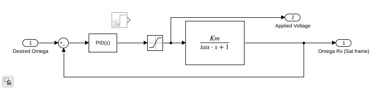

# Michael Giglia CV

# *Robotics Crash Course [RCC] (2020 - Present)*

### Overview
*For a more in-depth view of RCC, please see <https://github.com/robotics-crash-course> please note, the repository does require some instruction to become useful as a user!*  

**Robotics Crash Course** was developed in under 2 months as a response to the beginning of the COVID-19 pandemic. Originally I had taught a hands-on engineering design process course each summer to approximately 25-30 students. But with the need for remote learning and a desire to teach a course this summer I wouldn't let cancelling be an option. So instead I purchased many robotics kits to generate some curriculum around to provide an introductory course in robotics to students. Unfortunately all the kits I purchased were sub-par so I decided to design one myself. This ended up saving a lot of money as I was able to produce, package and ship 50 kits with one laser cutter and 3 3D-printers in my garage during the couple of months prior to the start of the course. It also meant that my curriculum would be better as I could design the robot with the course in mind.  
**pic**  
As the years went on the capabilities of the robot increased. In 2021 I added single channel incremental encoders to each wheel to allow the students the ability to keep track of how far the robot had traveled either in a linear fashion or a rotational fashion. As well, these encoders enabled the students to apply velocity feedback control on the wheels.  

In 2023 RCC moved from an Arduino UNO as the micro-processor to a much more powerful raspberry pi pico-w which had wireless capabilities. The addition of wireless gave me a new challenge of getting a communications protocol developed for the students to use, again in only a few months time, as well as a methodology for the students to make their own custom messages to be sent over the wireless network. During this time I also needed to modularize the Arduino UNO libraries and utilities created in previous years to be compatible with the rpi pico sdk.

Also in 2023, one of my TA's who pushed to move to the pico-w, designed a "RAFT" for the pico-w to sit in. This board had it's own 3V3 and 5V buck-converters as well as reverse polarity protection to help prevent minor errors like attaching a 9V backwards from catastrophically damaging the pico-w. In years past it was typical for an Arduino UNO to get damaged, but this board was robust to the plethora of errors students make when prototyping electronic systems. Please see <https://github.com/robotics-crash-course/rccdocs.github.io/blob/main/pages/html_pages/RAFT-DATASHEET.pdf>  

During this time I hired a student to design a simplified serialization/deserialization library that could be leveraged for the wireless communications protocol. It was designed for both python3 and C++. <https://github.com/robotics-crash-course/serial-packets> This module works great and with a small 20 minute lesson, students were able to make their own "messages" to be sent over the wireless network to be received by the pico-w. The pico-w would then deserialize this and custom code could be executed upon receiving of this message. Students were able to wirelessly control the robot with their keyboard or a gamepad. They setup their keyboard/gamepad in python, then sent messages over the network using python. Of course, without the 20 minutes of instruction, use of the library would be very hard as it is quite complex, but I was astonished at how much the students, who were in high school without prior coding experience, were able to make work with such a small amount of instruction. Currently, I am working on code generation for this serial-packets library similar to how ROS/2 generate C/C++ code for the messages/services/actions from their IDL (interface definition and language) protocol. Using cog and lark (python3 libraries) I am able to parse a .msg file that follows a standard I define to then generate all the boiler plate necessary for the serial-packets library. This way message development is much less time consuming for students!

### Reflection
Developing RCC is such a great learning experience for me. I get to challenge myself by creating usable libraries that allow for the students to rapidly script solutions to various challenges (see [challenges](https://robotics-crash-course.github.io/rccdocs.github.io/pages/sm_challenges/smchallenges.html)). I also get to refine my own understanding of much of my formal engineering education such that I can be a more effective instructor, providing students with the lifelong knowledge I had previously gained.

Now that this course has been used successfully for the freshman design course at The Cooper Union, I'm to make the software even more robust and have more useful features! RCC is the "swiss-army-knife", as my manager likes to call it, for micro-controllers and I hope to further develop this project for both instructional/educational use and as a rapid-prototyping tool for interdisciplinary projects.

### Topics covered
1. Electronics Circuit Theory 
2. Using the Unix environment 
3. Programming micro-controllers in C/C++ 
4. Practical lessons of how to use various sensors 
5. Programming using Python 
6. Introductory Calculus 
7. Introductory Physics 
8. Visualization tools for algorithms 
9. Logical block diagrams 
10. Finite State machines 
11. Introductory 3D CAD modelling using OnShape 
12. Engineering Design Process 
13. Engineering Decision Matrix 
14. Stability/Instability analysis of “Systems” 
15. Introduction to Feedback Control 
16. Self-Driven Final project with material and time constraints 

#### Applied Skills and Tools
CAD, Rapid-prototyping, rapid-software-dev, Python3, C/C++, curriculum development, material procurement, robot kit manufacturing/packaging/shipping, real-time hardware and software debugging (remotely and in-person)

# *Reaction-Wheel System (Dec 2022 - Jan 2022)*
## Overview
The reaction wheel system was a self-driven project to test my ability for rapidly prototyping from scratch a system that I had not built before. In this case I wanted to recreate a satellite attitude control system. I gave myself the winter break (since I work at a college) to start and complete this project which is approximately 1 month. One of the main goals of this project was to formally design, identify, simulate and tune the entire system to show my capabilities and thinking process through a complex interdisciplinary prototype.

The following was designed and manufactured in that time frame:
1. Mechanical system and iterations
2. Electrical system and iterations
3. Firmware for the on board micro-processor (an arduino UNO)
4. GUI for testing, data collection and analysis (in Qt and Python3)
5. System identification via experimental data
6. Simulation and ballpark controller tuning in MATLAB/Simulink
7. Final controller tuning by hand  

Here's the final design!  

Since I was highly time constrained for this project I had used whatever was in my garage. Here is a components list:
1. 12V DC motor with integrated quadrature optical encoder (51:1 Gearbox ROTORSHAFT:OUTPUTSHAFT)
2. MPU6050 for satellite angular velocity measurements
3. 3V DC motor with small propeller
4. 6 pole slip-ring to power and communicate with the device
5. L298N 2 Channel H-bridge
6. Custom 3D printed / Lasercut elements

### Why the propeller?
To make the project more realistic, I wanted the ability to desaturate the reaction wheel. In this case I decided to use a small dc motor and a propeller to act as a "gas thruster" that could be used to add/remove angular momentum to desaturate the wheel. As well, I purposely added some weights to the system to add a component of "gravitational drag". Essentially, the control system wants to hold at a certain angle but due to the imbalance at this angle, gravity wants to rotate the satellite away from this attitude. To hold the attitude the reaction wheel must spin up and eventually will saturate losing all control authority. Though the effect of this simulated "gravity drag" is orders of magnitude greater than what would be seen by a real **Satellite**, this ended up working out great as a nice demo to see the saturation/desaturation process quickly.

## System and Actuator Identification
#### "Gas Thruster"
To get an estimated torque that would be applied when the small propeller was turned on I made a small setup with a class 1 lever. The propeller would spin generating force at one end, the pivot in the middle, and the other end pushed on a small scale that a resolution of 0.1 grams. Different duty cycles were sent to the motor and a reading on the scale was recorded to get a thrust vs. duty cycle curve. The prop passed through an optical interupt sensor so an approximation of the angular velocity of the propeller could be recorded as well.

### Inertia ratio discussion
To properly simulate the system in simulink the inertia of each section must be known. In this case the reaction wheel, dc motor rotor and small gears make up the inertia of what I will call the "**Reaction Mass**". The dc motor stator and case, electrical components, and other elements make up what I will call the "**Satellite**" portion of the system. Together these subsystems give us the total inertia of the system, but it is also important to know individually their inertias. This "inertia ratio" combined with the maximum rotational velocity of the 12V DC motor lets me, the engineer, know the maximum angular momentum that can be absorbed by the **Reaction Mass**. It also gives me an idea about the control authority capabilities of the system. For example, if the **Reaction Mass** was 1/10 of the inertia of the **Satellite**, and my 12V dc motor is geared down a lot (which it is), it would be very hard to reject disturbances and keep a desired attitude. It also would mean that the system would saturate essentially instantaneously. All of this is important but even more imporant is getting a proper simulation running so that controller tuning can be done quickly (remember the time constraints).  

So how did I get these measurements. At first I decided to use my CAD model to estimate the inertia, but unfortunately the CAD model is not very accurate since I had used 3D printing to manufacture the parts. Given the time constraints I didn't want to use 100% infill so very low infill was used to speed up the manufacturing process causing this inaccuracy of the CAD model. Even if I could use the CAD model, I would have needed to take apart the DC motor and weigh out each element then estimate inertias for all of those components. Instead I dedcided an experimental method to determine the "bulk inertia" may prove more useful.  

#### Reaction mass actuator identification
To model the 12V DC motor I decided to do a typical step input test to get a first-order model. To do this the **Sattelite** portion of the system was fixed (preventing it from rotating). The DC motor was then given a 12V step input and the angular velocity of the reaction wheel was measured using the quadrature encoder and the known gearbox ratio. A simple system gain and time constant would then be calculated using typical system id methods. A second order low pass filter was applied with a bandwidth of 40Hz to remove as much noise as possible. It was also applied to the data in the forwards and reverse direction to reduce any delay that would be added due to the filter. This made the filter effectively a 4th order lpf. Note this was done in post processing, not in real-time as applying a filter reverse in time is not possible! In this case the steady state angular velocity would provide me my total system gain (K), and then the time it takes the system to get to 63.2% of the steady state velocity gives me my time constant (tau). This can easily be added into simulink as a Laplace domain model and is sufficient for simluation!  

#### Total Inertia
To get the total inertia of the system I wrapped some thread around the **Reaction Mass** portion, mounted the system so that its rotation would be parallel to the gravitational field. This prevented oscillations in the data collection from an unbalanced system which remember was done on purpose to simulate "gravity drag". Then a small weight was added to the end of the thread and hung over a smooth surface to minimize friction as well as change the direction of the thread so that gravity can pull on the weight. I then measured the angular velocity over time until the weight hit the ground. By taking the derivative of the angular velocity I can get an approximation of the angular acceleration applied to the whole system. Then since I know the applied torque (weight at the end of the thread and the radius it was applied) I can back out the total inertia of the system. This is not completely true as I do need to remove the friction due to the slip ring which is discussed later, but by "feed forwarding" the acceleration due to the slip ring back into the data I was able to remove the frictional effects and get the total inertia of the system. Which along with some manual calculations using the values from CAD as well as my own measurements was within what I considered reasonable for the testing seup I had available.  

#### Inertia ratio
Calculating the inertia ratio was much more difficult and it took me some time to come up with a good way to estimate this. At first I thought maybe I would be able to separate out the **Reaction Mass** and the **Satellite** and do the same total inertia test on each one individually. This would not be a feasible solution though as the 12V DC motor inherently has elements part of each of these subsystems. So instead I decided to use the motor itself to spin up the **Reaction Mass** and subsequently the **Satellite**. From here I would be able to use the encoder reading to get the angular velocity of the reaction wheel (and the motor stator knowing the gearbox ratio) that is in the **Satellite**'s frame (this is very important). And then I would be able to use the IMU (MPU6050) to get the angular velocity of the **Satellite** in the global frame. From here I would be able to use the angular velocity ratio to get an "effective inertia ratio". I call it an effective inertia ratio because some elements of the **Reaction Mass** spin at different rates. Unfortunately the friction due to the slip ring made this analysis not as straight forward. In post analysis I again needed to apply an acceleration to the data to remove the frictional effects. Once that was done the angular velocity ratio would then be used to get the effective inertia ratio. That combined with knowing the total inertia would provide me with the inertias of each of the subsystems.  

#### Slip Ring friction
To calculate slip ring friction I simply spin up the entire system by hand and record data as the system slows to a stop. From here I can determine the acceleration due to friction and use this estimate to "remove" frictional effects from the data for other system identification methods. The frictional effects were quite constant over the different angular velocities which was nice. Though not 100% constant, for the time and material constraints this was sufficient! This was also added to my simulink model as a "coloumb friction" block.

### MATLAB/Simulink Model
The controller topology is a Cascaded PID type with 3 loops. From the inner most to outer most loop the names I will use are **Wheel Velocity Control**, **Sattelite Angular Velocity**, **Sattelite Attitude**, respectively. The intuition is as follows. The **Sattelite Attitude** loop outputs a desired angular velocity which is then used to get an angular velocity error which is fed into the **Sattelite Angular Velocity** loop. The **Sattelite Angular Velocity** loop then outputs a desired torque. This is fed through a simple mathematical model using the Reaction Wheel's current angular velocity and known inertias to output a desired wheel angular velocity (this can be thought of as a Feed Forward model). This creates a wheel angular velocity error which feeds the **Wheel Velocity Control** loop. This control loop outputs a voltage that will spin up/down the Reaction Wheel and generate torque on the Sattelite.

This is all that needs to be implemented on the micro-processor to get a controller (this logic is embedded in lines 74-105 [Feedback Logic](https://github.com/mgiglia92/reaction-wheel/blob/36567f2caa8b0d2192c346621a4ef0073b126154/src/arduino/full_app/full_app.ino#L74C7-L105C6)). But for the Simulink model I also must model external forces and the motor itself. The first order motor model is embedded in the **Motor Model** block which also contains the feedback control for the **Wheel Velocity Control** loop. As well, the Friction and applied torque to the satellite must be modelled explicitly in Simulink. 

The purple section in the Simulink model houses these explicitly physical first principles. The input signal into this section of the model is the angular velocity of the wheel. The derivative of this is taken to get an angular acceleration at the wheel. It is passed though a gain block to convert it into the acceleration applied to the satellite with conservation of angular momentum. Then the friction model's angular acceleration is also added to the satellite's total angular acceleration. This is the integrated twice to get the angular velocity and attuitde of the satellite. These signals are fed-back where necessary.

For the following data I have removed the slip-ring friction model.

As you can see the reaction wheel spins up briefly to increase the angular velocity of the satellite and then slowly spins back down as the sattelite approaches its setpoint. There is a bit of angular velocity left on the reaction wheel once the sattelite reaches it's desired setpoint in the simulation and I believe this is due to some numerical integration/derivative drift as my time step is 10ms.

Unfortunately I have not saved data from the system to compare the simulation transient response to the real system, but by looking at the video we can see that the transient response is very much similar to the simulation data. As well in the video we can see the system's robustness to significant disturbances that would be unlikely seen in an application such as a satellite attitude control system. The "jittering" seen here is due to the backlash in the gearbox of the reaction wheel's dc motor. If a direct drive system was setup this "jittering" would most likely disappear. In the case it did not, that may mean one of the inner loops has too high of a proportional gain and should be lowered to prevent oscillations due to the controller. 

In the following video two things can be seen. Static reference tracking with a manual disturbance input (via my finger). During this time you can see the reaction wheel saturate then get desaturated by the propeller which is using a simple hysteresis control once the reaction wheel reaches 70% of its maximum angular velocity. In the second part you can see the satellite tracking a sine wave and similarly the reaction wheel saturating/desaturating.

Reaction Wheel Video  

<video width="1000" controls>
  <source src="rxwheel.mp4" type="video/mp4">
</video>

Sattelite Simulation  

Motor Model  
  
In the motor model we can see a discrete PID block, a saturation block to limit the applied voltage to the motor and then the first order motor model.  
Torque Conversion  

# Optimal Control / Trajectory Generation and Differential Geometry for a combined Land & Aerial Vehicle
This project came about initially as a way for me apply my formal classical and modern controls education making sure I have not lost the knowledge I had gained years ago. 
#### Description  
One of my favorite video games is a game called Rocket League. In this game the player controls a racecar to play soccer vs an opponent. It can be team based or one on one. The car is very agile on the ground, and it can also "jump" and transition into an aerial state turning its controls into a rocket, hence the name Rocket League. At some point in my time playing the game I found that there was a community around building "bots" to compete against each other in this game. The "bots" would be completely autonomous and run custom made algorithms to hopefully beat the other player. I was so interested in this as I thought it was the perfect place to apply my control systems knowledge. The main reason was I had realized most of the "bot makers" were not doing feedback control AT ALL! So I started my journey on making my own rocket league bot in hopes to beat other bots and maybe even professional players.
#### Initial Goals
To start, I decided it would be beneficial for me to apply my formal classical and modern control systems knowledge to the system to make sure I still had it in me. So I decided to start with a simple "height control". The rocket car would start in the air facing it's booster towards the ground and a simple PID controller would keep the car at a certain height, fighting gravity. This worked so I moved from the classical PID into a Full State Feedback control, one of the early modern control algorithms I had learned about (it is essentially a pole placement method). This was quite easy to implement as this constrained system is easy to linearize by ignoring the control input limits! Now that Full State Feedback was working in single dimension control I decided to move onto planar control by allowing one degree of rotataion that was orthogonal to gravity. Now is where things get complicated. The system is no longer SISO and is now a MIMO system that has it's state and control variables co-dependent. This means it is not possible to orthogonalize the control and state dimensions. So I decided to try my hand at linearization of this system and this worked well! But unfortunately to control along the entire configuration space (though still constrained) I would need to use gain scheduling or some other form of control (maybe LQR, MPC?). It was from here that I decided moving away from these "simple" controllers was necessary and would provide me great learning goals as well!
#### Rocket Attitude control
Before we can get into the really fun stuff, I must first have a controller that can quickly and stably track a reference attitude (in this case a quaternion representing a rotation from the world frame). This reference attitude will be generated from a "higher level" algorithm to attain some specific goal (like target interception in the next section). For this controller I found a really nice paper [Drone Attitude Control] which was exactly what I was looking for. If I have a quaternion the describes my desired attitude and a quaternion that is my current attitude I can generate an "error quaternion" and feed that into what is essentially a non-linear Full State Feedback (FSB) controller. From here I can tune the gains to get an acceptable response time, determine my bandwidth and use that bandwidth as a limiter for the attitude reference generation from the "higher level" algorithms.  
I also tried some other iterations on this controller. The non-linear FSB uses the velocity control as a damper to the system trying to hold the system at zero angular velocity. If instead we fed-forward a current angular velocity from an attitude trajectory it would be possible to minimize dynamic tracking errors. But to do this nicely would require some external trajectory infrastructure that I decided would be better put off until later when I integrated my algorithms with ROS2. SO for now the non-linear FSB would be sufficient.
Here's a video of the described attitude controller working together with a custom thrust controller to track a circle trajectory. Notice the large overshoot, this is due to a very large initial error and the fact that to changing acceleration direction requires a rotation of the body. This lag is inherent in the system's dynanmics so a more sophistacted feedback controller, maybe a model predictive controller (MPC) would need to be implemented to account for this and minimally hinder performance.  
[Circular Trajectory Tracking]  

#### Target interception
Now that I was confident my controls knowledge was still in me, and I had a way to control the attitude of the rocket, I decided to do some digging around about trajectory control, projectile interception and optimal control. One of the first things that popped up in my research was missile interception control algorithms. Specifically "True Proportional Navigation" which is a missile control algorithm that sets up and achieves two goals. The first is to remove any rotation of the "Line of Sight" (LOS) vector. The LOS vector is the vector that connects the missile's center of mass to the desired projectile's center of mass. If this vector has no rotation in the global frame (and we assume there is some velocity towards the projectile along the LOS), given some time the missile will intercept the projectile. The second goal is to accelerate along the LOS to cause interception to happen quickly. There are some variations on TPN that I had tried as well such as gravity compensation and projectile acceleration compensation. Luckily some military documents were declassified on this algorithm and I was able to implement it successfully!!  
In the following [TPN Driving] video we can see the same TPN algorithm applied in the driving state. This is a little different and required some adaptations since when driving there is no way to laterally accelerate, due to the no-slip condition, so the acceleration term output from the TPN algorithm needed to instead control the steering wheel. This is also why we see some jittering once the LOS rotation rate is brought near zero. I believe the control algorithm can be cleaner using gain scheduling or some other more advanced application of the TPN algorithm. But this was sufficient for me to move onto the next goal of the project.

#### Optimal Trajectory Generation
The project at this point had taken a huge tangent away from the initial goal which was to make a bot that can beat other bots. This was okay as I learned a lot and gained confidence in my understanding and application of control algorithms. But now it was time to work on something that could be leveraged in a 1v1 competition. It was at this point I decided that a minimum time to interception with the ball considering the rocket's control input limitations would be crucial in both intercepting the ball in minimum time, but also being able to determine which player would hit the ball first if both committed to intercepting it at this moment. At first I wanted to do it all, optimize a trajectory the includes driving, jumping and then flying into the ball but this is a multi phase optimal control problem and I wasn't ready for this yet, so I decided to constrain the problem statement to just **Time Optimal Aerial Interception**. This would simplify the objective and would also allow me to re-familiarize myself with the fundamentals of optimization.  
So I again went to reading papers, scouring forums and eventually found this very nice non-linear optimization library called [APMonitor]. APMonitor also has a very concise python library called GEKKO which has all the capabilities of APMonitor wrapped up nicely. I started with just doing a simple single dimensional time optimal control problem which was one of the example problems. But I quickly found that this problem was way to simple for what I wanted to do ultimately. So after some fiddling around I decided that I needed to really grasp the formal mathematics behind functional optimization. And this is where the rabbit hole starts.  

I purchased a book called [Optimal Control with Aerospace Applications] which is a great book on the formal math behind the Calculus of Variations and the Euler-Lagrange method but presents it in a way that was less so about formal proofs, but more of an intuitive understanding for a lesser-mathematician. Unfortunately, my problem was too complex to get an analytical solution, but my time spent reading the book greatly helped me in understanding how functional optimization works! So I needed to move onto a numerical method which is what I was doing with GEKKO anyway.  

#### Time Optimal Aerial Interception  
I stepped out of the rabbit hole for a moment and went back to building a practical set of scripts/modules that would allow me to generate time optimal trajectories to intercept the ball. Even though the textbook didn't directly help me, for some reason it inspired me, and I was able to very quickly generate a solution to the **Time Optimal Aerial Interception** problem. Using a heading vector that described the direction the rocket may accelerate, this heading vector could be rotated by the 3 torque inputs on the rocket. The solver could then easily determine a set of feasible heading vectors over the trajectory to intercept the ball in minimum time.  
The thrust control (4th control input) presented a large challenge. In the game, the thruster is an on-off type actuator, somewhat similarly limited like real rocket engines. This required the solution to incorporate "integer" or binary type variables. This drastically increases solver convergence time as well as sometimes would prevent the solver from converging at all. So I decided to move away from an "integer" type solution and decided that I could mitigate the model mismatch in my trajectory tracking controller since.  
Some other fun tests I had done here was adding an interception with a ball that would bounce at least once before interception was possible. This was surprisingly quite easy to do as instead of defining the ball's state through forward integration with the solver, I instead used a parametric polynomial approximation of the ball's trajectory including the discontinuous bounce. The solver then was able to determine the minimum time to intercept this new bouncing ball!
Here's a video of the execution of a generated time optimal trajectory [TimeOptimalAerialExecution]. The attitude reference is fed forward into the attitude feedback controller. This is a poor way to track the trajectory as it's an open loop controller on the full trajectory.

#### Time Optimal Driving Interception
Just like the aerial interception, I made a driving interception algorithm that would do the same, intercept in minimum time. I thought this would be straight forward but the constraints on the driving dynamics are much more complicated than the aerial dynamics. For example, the minimum turning radius of the car is velocity dependent. As the car travels faster it cannot turn as tightly. Adding the constraint was not too bad, but unfortunately the true dynamics of the game are piecewise linear. To implement a piecewise linear constraint would require an "integer" solver again which slowed down the convergence time or prevented it all together. So a polynomial approximation was used again and this proved to work nicely! Similarly, the maximum acceleration possible is also velocity dependent. This was solved using the same parametric polynomial approximation.  
Here I also added the ability to compare two vehicles with different initial conditions and the same ball initial condition. It would then show the two trajectories and one could determine which vehicle would hit the ball first and with how much of a lead. This is important game theory wise as the more time you have to intercept the ball before the opponent can block, the more options you have for hitting the ball away from the player and potentially into the goal.

#### Differential Geometry and Optimization on a Manifold
It was at this point that I stepped back into the rabbit hole. I was happy with my implementations so far. Time Optimal Aerial and Driving Interception was understood and working. Attitude control was working and I was on my way to start a multi-phase optimal control method when I stumbled upon [ManOpt]. ManOpt is a manifold optimization toolbox supported in MATLAB, Python3 and Julia. Why did I find ManOpt? Well, in Rocket League the field isn't a regular soccer field with an out-of-bounds. Instead the "field" is more like a cage where the ball can bounce off the walls and ceiling. The car can also drive along the wall and ceiling (though only briefly on the ceiling). This made me immediately think of manifolds in R3. I did the same thing as before, did some online research, read some papers, scoured some forums and ManOpt showed up. I thought this was perfect. If I could model the "cage" as a manifold, then I should be able to leverage the ManOpt solver to generate me minimum time trajectories just like in my driving optimal control solver. My intuition told me that the solver would be much faster as I am essentially removing many calculations in each step of the solver. The constraints are explicitly respected since the mathematical system always provides a point on the manifold itself, preventing the need to augment the numerical output of each step of the solver to respect the constraint. On top of this, the search space for the solver has at least one dimension removed as you would be searching locally in the Tangent Space. In the case of my cage manifold, that would be going from R3 to R2! I also believed that my multi-phase needs may also be able to be met by representing the entire trajectory including the phase transition as a manifold itself! Currently this is where I am mathematically with this project. I am ever deep in this rabbit hole and am hoping to continue learning about Differential Geometry and it's potential applications in not only this project but potentially many controls projects that I am interested in.

#### Integration ROS2 with Rocket League
One of the biggest issues in development of this project is how many separate pieces of infrastructure need to be built to effectively build, test, and debug such a complex system. As well, it proved difficult to have a "plug and play" type system where I could in real-time test out different controllers, gains, algorithms etc...  This was mostly due to the RLBOT library (the library the community created to interface with the game) not being very modular or editable. Having used ROS/2 in many projects at work and for some of my own projects I decided that this was a great time to make the development process more streamlined by integrating ROS2 into the Rocket League Bot communities library. And what do you know, this ended up working amazingly. By setting up a ROS2 node inside the RLBOT library, I could then externalize all of the business code in a separate node and communicate necessary information via two "Topics". I would also be able to create ROS2 services and actions that could make setting up and executing complex scenarios very simple! I've been able to implement this successfully and can easily control the vehicle through an external controller node. This controller node can be hot-swapped to any other node with the same publish and subscribed topics to test out quickly various controllers/algorithms without needing to restart the RLBOT application! Now that this is complete I've moved back into learning about optimization on manifolds and grinding out my mathematical knowledge in this subject. With the ROS2 interface and my newly acquired Differential Geometry knowledge my bot will be unstoppable!!  
See [rlbot_ws] for the created package. Please note; it is not in a deployed state

#### Future Thoughts
Post collision trajectory is an important element of this system. Can the set of post trajectory collisions be modelled as a manifold for both players to aid in determining optimal interception angle for example? Can a subset of the opponents optimal trajectories be modelled as a manifold and do I have a post collision trajectory that exists outside the set of time optimal interceptions trajectories for my opponent? Can all of these get computational speed increases by using manifolds as a mathematical tool? Does stochastic analysis benefit from using manifolds in the modelling?

How can this be 

# *CU@HOME*  
CU@HOME was made in response to the COVID-19 pandemic as the school needed to shift to remote learning. Here's a write up Cooper did about it [CU@HOME].  

## DC Motor / Controls Lab / Drone Controls Lab  
   

   

  

## Ball-Beam Balancing

## Experimentation Lab

## Crazyflie Gimbal
   

# *"Carrie" Ackerman Steering Robot*

[CU@HOME]:<https://cooper.edu/engineering/news/unpacking-cuhome-engineering-kits>
[Drone Attitude Control]:<https://www.diva-portal.org/smash/get/diva2:1010947/FULLTEXT01.pdf>
[TPN Driving]:<https://youtu.be/08Zp20O6l7g?si=aZFB-WuvDtggxGFJ&t=29>
[Circular Trajectory Tracking]:<https://www.youtube.com/watch?v=l8AXIaWtm34>
[APMonitor]:<http://apmonitor.com/>
[Optimal Control with Aerospace Applications]:<https://link.springer.com/book/10.1007/978-1-4614-8945-0>
[ManOpt]:<https://www.manopt.org/>
[rlbot_ws]:<https://github.com/mgiglia92/rlbot_ws/tree/prototype>
[TimeOptimalAerialExecution]:<https://www.youtube.com/watch?v=jaUyVbouPlI>