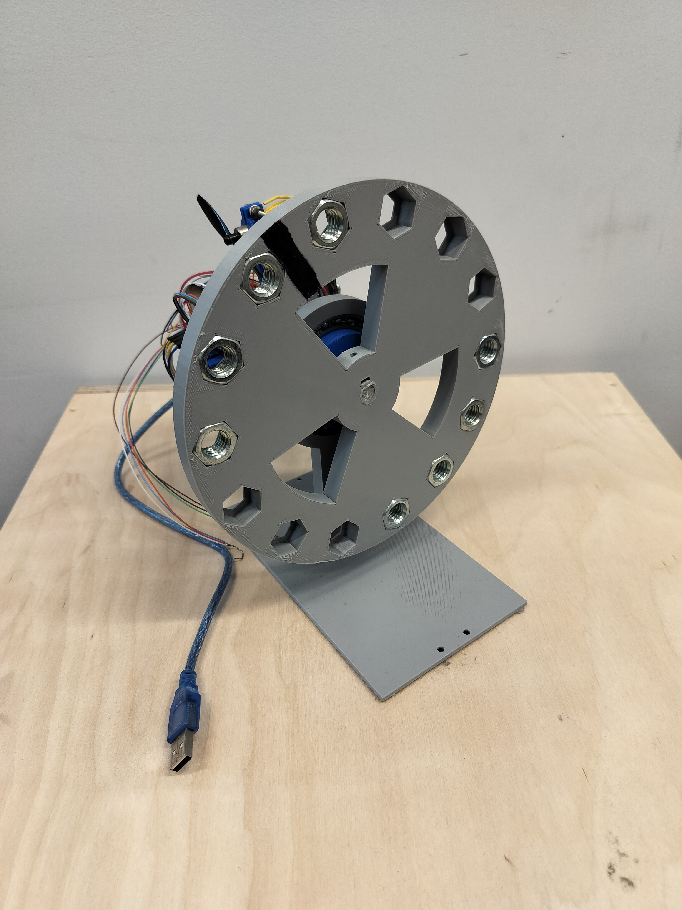
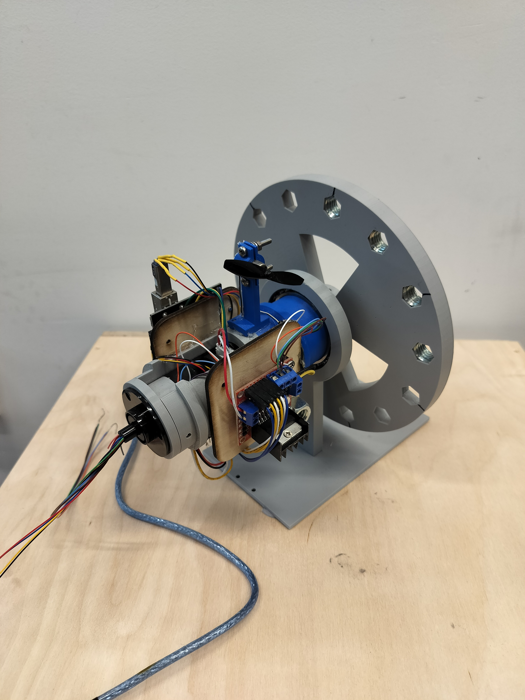
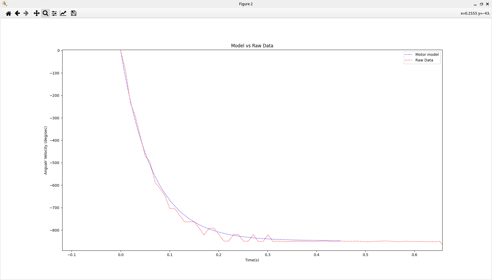
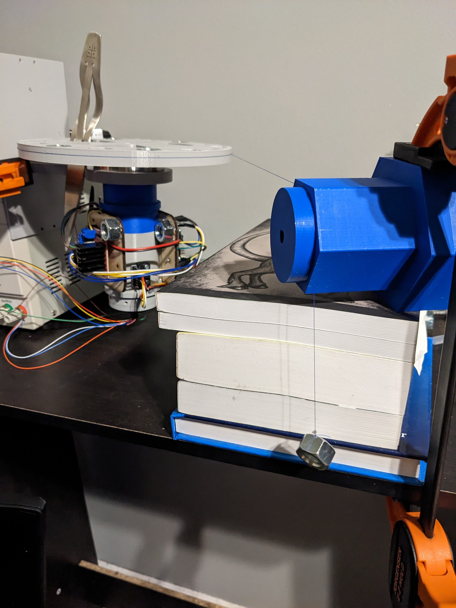
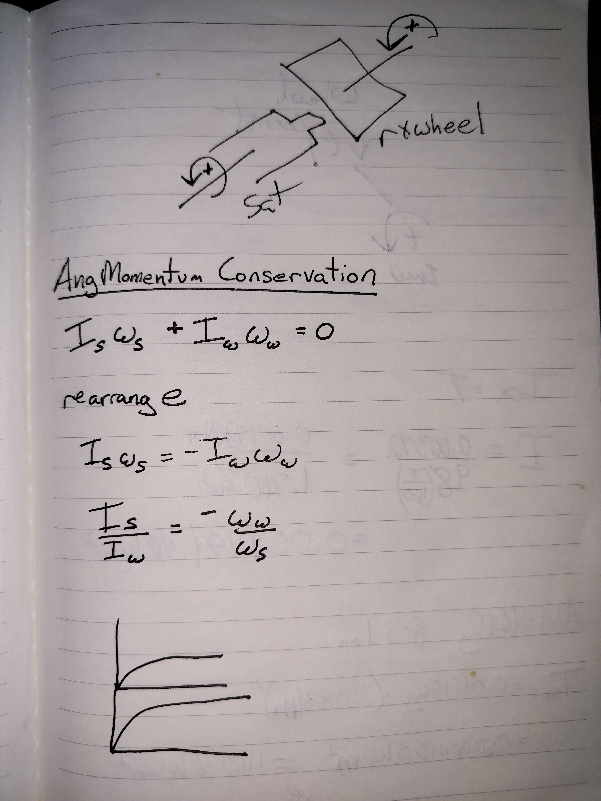
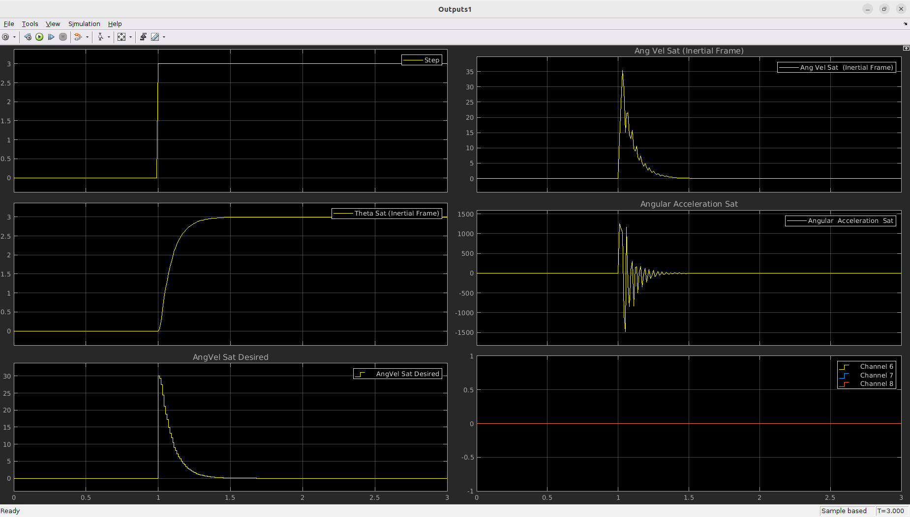
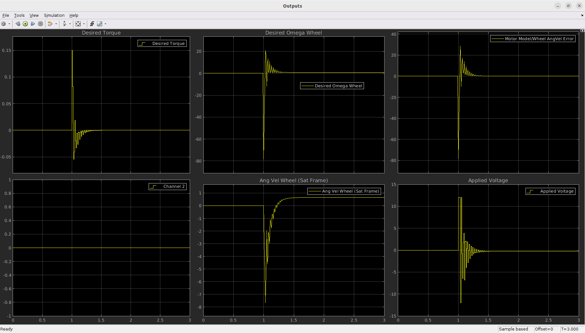
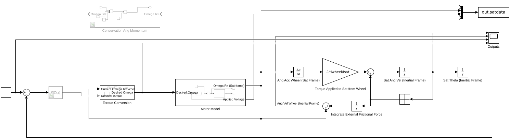
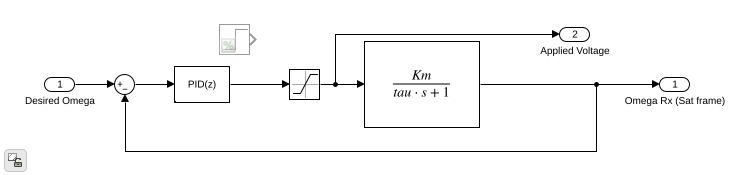
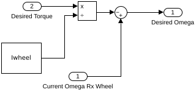

# Michael Giglia CV

# *Robotics Crash Course [RCC] (2020 - Present)*

### Overview
*For a more in-depth view of RCC, please see <https://github.com/robotics-crash-course> please note, the repository does require some instruction to become useful as a user!*  

Robotics Crash Course was developed in under 2 months as a response to the beginning of the COVID-19 pandemic. Originally I had taught a hands-on engineering design process course each summer to approximately 25-30 students. But with the need for remote learning and a desire to teach a course this summer I wouldn't let cancelling be an option. So instead I purchased many robotics kits to generate some curicculum around to provide an introductory course in robotics to students. Unfortunately all the kits I purchased were sub-par so I decided to design one myself. This ended up saving a lot of money as I was able to produce, package and ship 50 kits with one laser cutter and 3 3D-printers in my garage during the couple of months prior to the start of the course. It also meant that my curiculum would be better as I could design the robot with the course in mind.  
**pic**  
As the years went on the capabilities of the robot increased. In 2021 I added single channel incremental encoders to each wheel to allow the students the ability to keep track of how far the robot had travelled either in a linear fashion or a rotational fashion. As well, these encoders enabled the students to apply velocity feedback control on the wheels.  

In 2023 RCC moved from an Arduino UNO as the micro-processor to a much more powerful raspberry pi pico-w which had wireless capabilities. The addition of wireless gave me a new challenge of getting a communications protocol developed for the students to use, again in only a few months time, as well as a methodology for the students to make their own custom messages to be sent over the wireless network. During this time I also needed to modularize the Arduino UNO libraries and utilities created in previous years to be compatible with the rpi pico sdk.

Also in 2023, one of my TA's who pushed to move to the pico-w, designed a "RAFT" for the pico-w to sit in. This board had it's own 3V3 and 5V buck-converters as well as reverse polarity protection to help prevent minor errors like attaching a 9V backwards from catastrophically damaging the pico-w. In years past it was typical for an Arduino UNO to get damaged, but this board was robust to the plethora of errors students make when prototyping electronic systems. Please see <https://github.com/robotics-crash-course/rccdocs.github.io/blob/main/pages/html_pages/RAFT-DATASHEET.pdf>  

During this time I hired a student to design a simplified serialization/deserialization library that could be leveraged for the wireless communications protocol. It was designed for both python3 and C++. <https://github.com/robotics-crash-course/serial-packets> This module works great and with a small 20 minute lesson, students were able to make their own "messages" to be sent over the wireless network to be received by the pico-w. The pico-w would then deserialize this and custom code could be executed upon receiving of this message. Students were able to wirelessly control the robot with their keyboard or a gamepad. They setup their keyboard/gamepad in python, then sent messages over the network using python. Of course, without the 20 minutes of instruction, use of the library would be very hard as it is quite complex, but I was astonished at how much the students, who were in high school without prior coding experience, were able to make work with such a small amount of instruction. Currently, I am working on code generation for this serial-packets library similar to how ROS/2 generate C/C++ code for the messages/services/actions from their IDL (interface definition and language) protocol. Using cog and lark (python3 libraries) I am able to parse a .msg file that follows a standard I define to then generate all the boiler plate necessary for the serial-packets library. This way message development is much less time consuming for students!

### Reflection
Developing RCC is such a great learning experience for me. I get to challenge myself by creating usable libraries that allow for the students to rapidly script solutions to various challenges (see [challenges](https://robotics-crash-course.github.io/rccdocs.github.io/pages/sm_challenges/smchallenges.html)). I also get to refine my own understanding of much of my formal engineering education such that I can be a more effective instructor, providing students with the lifelong knowledge I had previously gained.

Now that this course has been used sucessfuly for the freshman design course at The Cooper Union, I'm to make the software even more robust and have more useful features! RCC is the "swiss-army-knife", as my manager likes to call it, for micro-controllers and I hope to further develop this project for both instructional/educational use and as a rapid-prototyping tool for interdisciplinary projects.


### Topics covered
1. Electronics Circuit Theory 
2. Using the Unix environment 
3. Programming micro-controllers in C/C++ 
4. Practical lessons of how to use various sensors 
5. Programming using Python 
6. Introductory Calculus 
7. Introductory Physics 
8. Visualization tools for algorithms 
9. Logical block diagrams 
10. Finite State machines 
11. Introductory 3D CAD modelling using OnShape 
12. Enginering Design Process 
13. Engineering Decision Matrix 
14. Stability/Instability analysis of “Systems” 
15. Introduction to Feedback Control 
16. Self-Driven Final project with material and time constraints 


#### Applied Skills and Tools
CAD, Rapid-prototyping, rapid-software-dev, Python3, C/C++, curriculum development, material procurement, robot kit manufacturing/packaging/shipping, real-time hardware and software debugging (remotely and in-person)


# *Reaction-Wheel System (Dec 2022 - Jan 2022)*
## Overview
The reaction wheel system was a self-driven project to test my ability for rapidly prototyping from scratch a system that I had not built before. In this case I wanted to recreate a satellite attitude control system. I gave myself the winter break (since I work at a college) to start and compelte this project which is approximately 1 month. One of the main goals of this project was to formally design, identify, simulate and tune the entire system to show my capabilities and thinking process through a complex interdisciplinary prototype.

The following was designed and manufactured in that time frame:
1. Mechanical system and iterations
2. Electrical system and iterations
3. Firmware for the on board micro-processor (an arduino UNO)
4. GUI for testing, data collection and analysis (in Qt and Python3)
5. System identification via experimental data
6. Simulation and ballpark controller tuning in MATLAB/Simulink
7. Final controller tuning by hand  

Here's the final design!  



Since I was highly time contrained for this project I had used whatever was in my garage. Here is a components list:
1. 12V DC motor with integrated quadrature optical encoder (51:1 Gearbox ROTORSHAFT:OUTPUTSHAFT)
2. MPU6050 for satellite angular velocity measurements
3. 3V DC motor with small propeller
4. 6 pole slip-ring to power and communicate with the device
5. L298N 2 Channel H-bridge
6. Custom 3D printed / Lasercut elements

### Why the propeller?
To make the project more realistic, I wanted the ability to desaturate the reaction wheel. In this case I decided to use a small dc motor and a propeller to act as a "gas thruster" that could be used to add/remove angular momentum to desaturate the wheel. As well, I purposely added some weights to the system to add a component of "gravitational drag". Essentially, the control system wants to hold at a certain angle but due to the imbalance at this angle, gravity wants to rotate the satellite away from this attitude. To hold the attitude the reaction wheel must spin up and eventually will saturate losing all control authority. Though the effect of this simulated "gravity drag" is orders of magnitude greater than what would be seen by a real **Sattelite**, this ended up working out great as a nice demo to see the saturation/desaturation process quickly.

## System and Actuator Identification
#### "Gas Thruster"
To get an estimated torque that would be applied when the small propeller was turned on I made a small setup with a class 1 lever. The propeller would spin generating force at one end, the pivot in the middle, and the other end pushed on a small scale that a resolution of 0.1 grams. Different duty cycles were sent to the motor and a reading on the scale was recorded to get a thrust vs. duty cycle curve. The prop passed through an optical interupt sensor so an approximation of the angular velocity of the propeller could be recorded as well.


### Inertia ratio discussion
To properly simulate the system in simulink the inertia of each section must be known. In this case the reaction wheel, dc motor rotor and small gears make up the inertia of what I will call the "**Reaction Mass**". The dc motor stator and case, electrical components, and other elements make up what I will call the "**Sattelite**" portion of the system. Together these subsystems give us the total inertia of the system, but it is also important to know individually their inertias. This "inertia ratio" combined with the maximum rotational velocity of the 12V DC motor lets me, the engineer, know the maximum angular momentum that can be absorbed by the **Reaction Mass**. It also gives me an idea about the control authority capabilities of the system. For example, if the **Reaction Mass** was 1/10 of the inertia of the **Sattelite**, and my 12V dc motor is geared down a lot (which it is), it would be very hard to reject disturbances and keep a desired attitude. It also would mean that the system would saturate essentially instantaneously. All of this is important but even more imporant is getting a proper simluation running so that controller tuning can be done quickly (remember the time constraints).  

So how did I get these measurements. At first I decided to use my CAD model to estimate the inertia, but unfortunately the CAD model is not very accurate since I had used 3D printing to manufature the parts. Given the time constraints I didn't want to use 100% infill so very low infill was used to speed up the manufacturing process causing this inaccuracy of the CAD model. Even if I could use the CAD model, I would have needed to take apart the DC motor and weigh out each element then estimate inertias for all of those components. Instead I dedcided an experimental method to determine the "bulk inertia" may prove more useful.  

#### Reaction mass actuator identification
To model the 12V DC motor I decided to do a typical step input test to get a first-order model. To do this the **Sattelite** portion of the system was fixed (preventing it from rotating). The DC motor was then given a 12V step input and the angular velocity of the reaction wheel was measured using the quadrature encoder and the known gearbox ratio. A simple system gain and time constant would then be calculated using typical system id methods. A second order low pass filter was applied with a bandwidth of 40Hz to remove as much noise as possible. It was also applied to the data in the forwards and reverse direction to reduce any delay that would be added due to the filter. This made the filter effectively a 4th order lpf. Note this was done in post processing, not in real-time as applying a filter reverse in time is not possible! In this case the steady state angular velocity would provide me my total system gain (K), and then the time it takes the system to get to 63.2% of the steady state velocity gives me my time constant (tau). This can easily be added into simulink as a Laplace domain model and is sufficient for simluation!  




#### Total Inertia
To get the total inertia of the system I wrapped some thread around the **Reaction Mass** portion, mounted the system so that its rotation would be parallel to the gravitational field. This prevented oscillations in the data collection from an unbalanced system which remember was done on purpose to simulate "gravity drag". Then a small weight was added to the end of the thread and hung over a smooth surface to minimize friction as well as change the direction of the thread so that gravity can pull on the weight. I then measured the angular velocity over time until the weight hit the ground. By taking the derivative of the angular velocity I can get an approximation of the angular acceleration applied to the whole system. Then since I know the applied torque (weight at the end of the thread and the radius it was applied) I can back out the total inertia of the system. This is not completely true as I do need to remove the friction due to the slip ring which is discussed later, but by "feed forwarding" the acceleration due to the slip ring back into the data I was able to remove the frictonal effects and get the total inertia of the system. Which along with some manual calculations using the values from CAD as well as my own measurements was within what I considered reasonable for the testing seup I had available.  


#### Inertia ratio
Calculating the inertia ratio was much more difficult and it took me some time to come up with a good way to estimate this. At first I thought maybe I would be able to separate out the **Reaction Mass** and the **Sattelite** and do the same total inertia test on each one individually. This would not be a feasible solution though as the 12V DC motor inherently has elements part of each of these subsystems. So instead I decided to use the motor itself to spin up the **Reaction Mass** and subsequently the **Sattelite**. From here I would be able to use the encoder reading to get the angular velocity of the reaction wheel (and the motor stator knowing the gearbox ratio) that is in the **Sattelite**'s frame (this is very important). And then I would be able to use the IMU (MPU6050) to get the angular velocity of the **Sattelite** in the global frame. From here I would be able to use the angular velocity ratio to get an "effective inertia ratio". I call it an effective inertia ratio because some elements of the **Reaction Mass** spin at different rates. Unfortunately the friction due to the slip ring made this analysis not as straight forward. In post analysis I again needed to apply an acceleration to the data to remove the frictional effects. Once that was done the angular velocity ratio would then be used to get the effective inertia ratio. That combined with knowing the total inertia would provide me with the inertias of each of the subsystems.  



#### Slip Ring friction
To calculate slip ring friction I simply spin up the entire system by hand and record data as the system slows to a stop. From here I can determine the acceleration due to friction and use this estimate to "remove" frictional effects from the data for other system identification methods. The frictional effects were quite constant over the different angular velocities which was nice. Though not 100% constant, for the time and material constraints this was sufficient! This was also added to my simulink model as a "coloumb friction" block.

### MATLAB/Simulink Model
The controller topology is a Cascaded with 3 loops. From the inner most to outer most loop the names I will use are **Wheel Velocity Control**, **Sattelite Angular Velocity**, **Sattelite Attitude**, respectively. The intuition is as follows. The **Sattelite Attitude** loop outputs a desired angular velocity which is then used to get an angular velocity error which is fed into the **Sattelite Angular Velocity** loop. The **Sattelite Angular Velocity** loop then outputs a desired torque. This is fed through a simple mathematical model using the Reaction Wheel's current angular velocity and known inertias to output a desired wheel angular velocity (this can be thought of as a Feed Forward model). This creates a wheel angular velocity error which feeds the **Wheel Velocity Control** loop. This control loop outputs a voltage that will spin up/down the Reaction Wheel and generate torque on the Sattelite.

This is all that needs to be implemented on the micro-processor to get a controller (this logic is embedded in lines [Feedback Logic](https://github.com/mgiglia92/reaction-wheel/blob/36567f2caa8b0d2192c346621a4ef0073b126154/src/arduino/full_app/full_app.ino#L74C7-L105C6)). But for the Simulink model I also must model external forces and the motor itself. The first order motor model is embedded in the **Motor Model** block which also contains the feedback control for the **Wheel Velocity Control** loop. As well, the Friction and applied torque to the sattelite must be modelled explicitly in Simulink.

The purple section in the Simulink model houses these explicity physical first principles. The input signal into this section of the model is the angular velocity of the wheel. The derivative of this is taken to get an angular acceleration at the wheel. It is passed though a gain block to convert it into the acceleration applied to the sattelite with conservation of angular momentum. Then the friction model's angular acceleration is also added to the sattelite's total angular acceleration. This is the integrated twice to get the angular velocity and attuitde of the sattelite. These signals are fedback where necessary.

For the following data I have removed the slip-ring friction model as it's effects are unintuitive just looking at data on graphs.
  
  
As you can see the reaction wheel spins up briefly to increase the angular velocity of the sattelite and then slowly spins back down as the sattelite approaches its setpoint. There is a bit of angular velocity left on the reaction wheel in the simulation and I believe this is due to some numerical integration drift as this is a discrete time simulation. 

Unfortunately I have not saved data from the system to compare the simulation transient response to the real system, but by looking at the video we can see that the transient response is very much similar to the simulation data. As well in the video we can see the system's robustness to significant disturbances that would be unlikely seen in an application such as a sattelite attitude control system. The "jitting" seen here is due to the backlash in the gearbox of the reaction wheel's dc motor. If a direct drive system was setup this "jittering" would most likely disappear. In the case it did not, that may mean one of the inner loops has too high of a proportional gain and should be lowered to prevent oscillations due to the controller. 

If you wish to see an analysis of the feedback controllers real response vs simulated response I can do that but just may need some time to get my hands on the device. It's currently not in my posession.

In the following video two things can be seen. Static reference tracking with a manual disturbance input (via my finger). During this time you can see the reaction wheel saturate then get desaturated by the propeller which is using a simple hysteresis control once the reaction wheel reaches 70% of its maximum angular velocity. In the second part you can see the sattelite tracking a sine wave and similarly the reaction wheel saturating/desaturating.

Reaction Wheel Video  

<video width="320" height="240" controls>
  <source src="rxwheel.mp4" type="video/mp4">
</video>

Sattelite Simulation  

Motor Model  

Torque Conversion  



# COMING SOON  
```
# *Optimal Control / Trajectory Generation and Differential Geometry for a combined Land & Aerial Vehicle*

# *"Carrie" Ackerman Steering Robot*

# *CU@HOME*
## DC Motor & Controls Lab
## Drone Controls Lab
## Ball-Beam Balancing
## Experimentation Lab
## Crazyflie Gimbal
```